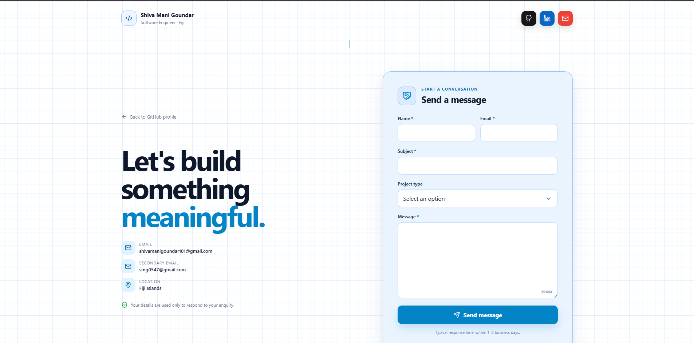
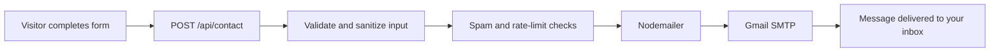

<div align="center">


<a href="https://nextjs.org/">
  
</a>
<a href="https://www.typescriptlang.org/">
  
</a>
<a href="https://vercel.com/">
  
</a>
<a href="https://nodemailer.com/">
  
</a>

<br><br>

A polished contact form for developer portfolios, personal websites and small business sites. It uses a server-side Next.js Route Handler to send messages securely through Gmail SMTP.

[View Demo](https://contact.shivafj.dev) · [Report a Bug](https://github.com/SMani0547/shiva-contact-form/issues) · [Request a Feature](https://github.com/SMani0547/shiva-contact-form/issues)

</div>

---

## Preview

<div align="center">



<p>
  <sub>
    Screenshot path:
    <code>docs/screenshots/contact-form-preview.png</code>
  </sub>
</p>

</div>

---

## About the Project

This project provides a ready-to-deploy contact page with a clean white background, subtle blue grid, light-blue contact card and responsive layout. Visitors can submit an enquiry from the browser, while the message is validated and sent securely from a server-side API route.

The form is suitable for:

- Developer portfolio websites
- Freelancer contact pages
- Personal profile links
- Small business enquiry forms
- Project and collaboration requests

## Features

- Responsive layout for desktop, tablet and mobile
- White background with subtle blue engineering-style grid
- Light-blue contact form card with clear visual hierarchy
- Brand-coloured GitHub, LinkedIn and email buttons
- Name, email, subject, project type and message fields
- Gmail SMTP delivery through Nodemailer
- Server-side input validation and HTML escaping
- Hidden honeypot field for basic bot protection
- Basic per-instance request rate limiting
- Message length counter and loading state
- Clear success and error feedback
- Reply-to address set to the visitor's email
- Vercel-ready Next.js Route Handler
- Easy theme, wording and field customization

## Technology Stack

<div align="center">


</div>

| Layer | Technology |
|---|---|
| Framework | Next.js App Router |
| Frontend | React and TypeScript |
| Styling | Custom responsive CSS |
| Icons | Lucide React |
| Email | Nodemailer and Gmail SMTP |
| Hosting | Vercel |

## How It Works



## Project Structure

```text
shiva-contact-form/
├── app/
│   ├── api/
│   │   └── contact/
│   │       └── route.ts
│   ├── globals.css
│   ├── layout.tsx
│   └── page.tsx
├── docs/
│   └── screenshots/
│       └── contact-form-preview.png
├── public/
│   └── favicon.svg
├── .env.example
├── .gitignore
├── next.config.ts
├── package.json
├── tsconfig.json
└── README.md
```

## Getting Started

### Prerequisites

- Node.js 20.9 or newer
- npm
- A Gmail account with an App Password

### Installation

Clone the repository:

```bash
git clone https://github.com/SMani0547/shiva-contact-form.git
cd shiva-contact-form
```

Install dependencies:

```bash
npm install
```

Copy the example environment file:

```bash
cp .env.example .env.local
```

On Windows PowerShell:

```powershell
Copy-Item .env.example .env.local
```

Start the development server:

```bash
npm run dev
```

Open:

```text
http://localhost:3000
```

## Environment Variables

Create `.env.local` in the project root:

```env
# Gmail account used to send contact-form messages
GMAIL_USER=your-email@gmail.com

# Google-generated App Password
# Paste the 16-character value without spaces
GMAIL_APP_PASSWORD=abcdefghijklmnop

# Inbox that receives submitted messages
# This can be the same address as GMAIL_USER
CONTACT_TO=your-email@gmail.com
```

| Variable | Required | Description |
|---|---:|---|
| `GMAIL_USER` | Yes | Gmail account used by Nodemailer |
| `GMAIL_APP_PASSWORD` | Yes | Google-generated App Password, not your normal password |
| `CONTACT_TO` | Yes | Destination inbox for contact-form submissions |

> [!IMPORTANT]
> Never commit `.env.local`, your Gmail password or your Gmail App Password to GitHub.

## Gmail App Password Setup

1. Enable 2-Step Verification on the Google account used for SMTP.
2. Create a Google App Password for the contact-form application.
3. Copy the generated password.
4. Add it to `GMAIL_APP_PASSWORD` without spaces.
5. Use the same Gmail address for `GMAIL_USER`.

The visitor's email is configured as the `replyTo` address, allowing you to reply directly from Gmail.

## Deploying to Vercel

1. Push the project to a GitHub repository.
2. Import the repository into Vercel.
3. Open **Project Settings → Environment Variables**.
4. Add:
   - `GMAIL_USER`
   - `GMAIL_APP_PASSWORD`
   - `CONTACT_TO`
5. Apply the variables to the environments you need.
6. Redeploy the project.
7. Replace the demo link at the top of this README with your Vercel URL.

Example production URL:

```text
https://YOUR-CONTACT-FORM.vercel.app
```

## API Endpoint

### `POST /api/contact`

Example request body:

```json
{
  "name": "Alex Smith",
  "email": "alex@example.com",
  "subject": "Project collaboration",
  "projectType": "Software Development",
  "message": "I would like to discuss a new web application.",
  "website": ""
}
```

Successful response:

```json
{
  "message": "Thanks for reaching out. I’ll review your message and respond as soon as possible."
}
```

## Security Notes

The project includes several basic protections:

- Email validation
- Maximum field lengths
- Request-size restriction
- Server-side HTML escaping
- Hidden honeypot field
- Basic IP-based rate limiting
- SMTP credentials stored only in server-side environment variables

For a larger public deployment, consider adding persistent rate limiting, CAPTCHA and a transactional email provider.

## Customization

### Update profile information

Edit the links and profile content in:

```text
app/page.tsx
```

### Change colors and layout

Edit:

```text
app/globals.css
```

The current design uses:

```text
Page background:  #FFFFFF
Grid lines:       #DBEAFE
Form surface:     #EAF4FF
Primary blue:     #0284C7
Accent blue:      #38BDF8
Heading text:     #0F172A
Body text:        #475569
```

### Change the email template

Edit the HTML and plain-text templates inside:

```text
app/api/contact/route.ts
```

## Add It to a GitHub Profile README

After deployment, add this button to your profile README:

```html
<a href="https://YOUR-CONTACT-FORM.vercel.app">
  
</a>
```

## Contributing

Contributions are welcome.

1. Fork the repository.
2. Create a feature branch:

```bash
git checkout -b feature/your-feature-name
```

3. Commit your changes:

```bash
git commit -m "Add: your improvement"
```

4. Push the branch:

```bash
git push origin feature/your-feature-name
```

5. Open a pull request describing the change.

## Suggested Roadmap

- CAPTCHA support
- Resend or Postmark transport option
- Persistent rate limiting
- Optional database submission history
- Automatic confirmation emails
- Additional themes
- Internationalization
- Form-field configuration

## License

This project is available under the MIT License.

## Author

<div align="center">

### Shiva Mani Goundar

Software Engineer from Fiji, focused on full-stack development, cloud integrations, AI solutions and practical digital systems.

<a href="https://github.com/SMani0547">
  
</a>
<a href="https://www.linkedin.com/in/shiva-goundar-270a901b9">
  
</a>
<a href="mailto:shivamanigoundar101@gmail.com">
  
</a>

<br><br>

If this project is useful, consider giving the repository a star.


</div>
